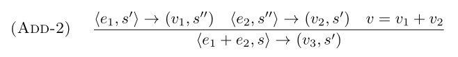

# Semantac - Static Analysis of Structural Operational Semantics
Semantac is a tool that allows for working with operational semantics in a less cumbersome way than many traditional tools do.

Having a semantic specification of an algorithm or language is a very precise way of defining it, but working with semantics and making sure the rules are error-free is hard when writing the specification by hand. Many tools like [PLT Redex](https://redex.racket-lang.org/) are designed to be "light-weight" but still require a lot of specific knowledge about the tool, which might lead to people never getting into mechanising definitions of SOS. Thus Semantac is designed to have a very intuitive interface for writing rules, and is designed to both tell designers about possible errors via static analysis, but also output the LaTeX needed to present semantics in a more human-readable way. This also gets rid of transcription errors that can occur when translating mechanised semantics into LaTeX semantics by hand.

## The language
A simple example of an SOS rule could be ***Add-2***:



Which when implemented in semantac becomes:

```
rule Add-2
<e1,s'> => <v1,s''>  <e2,s''> => <v2,s'>  v == add(v1,v2)
---------------------------------------------------------
               <e1 "+" e2, s> => <v3,s'>
```

This is hopefully readable by most people that can read the LaTeX version, and does not require knowledge of Lisp or another programming language which is necessary when working with tools like Redex.

